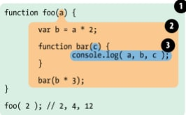

# JavaScript Functions
A JavaScript function is a block of code designed to perform a particular task.
A JavaScript function is executed when "something" invokes it (calls it).

# JavaScript Function Syntax
A JavaScript function is defined with the function keyword, followed by a name, followed by parentheses ().
Function names can contain letters, digits, underscores, and dollar signs (same rules as variables).
The parentheses may include parameter names separated by commas:
The code to be executed, by the function, is placed inside curly brackets: {}

Function parameters are listed inside the parentheses () in the function definition.
Function arguments are the values received by the function when it is invoked.
Inside the function, the arguments (the parameters) behave as local variables.
# Function – Declaration
The syntax to declare a function is:

# Function – Expression

# Arrow Function

# Scope
The building our represents program's nested 
scope ruleset. The first floor of the building 
represents your currently executing scope, 
wherever you are. The top level of the building is 
the global scope
# Scope – Lexical Scope
Lexical scope is scope that is defined
at lexing time. In other words, lexical 
scope is based on where variables
and blocks of scope are authored, by 
you, at write time, and thus is
(mostly) set in stone by the time the lexer
processes your co

# Scope –Global Scope
A variable declared at the top of a 
program or outside of a function is 
considered a global scope variable

# Scope – Local Scope
The variable can also have a local scope, 
it can only be accessed within a function.
In the below program, variable a is a 
global variable and variable b is a local 
variable. The variable b can be accessed 
only inside the greet function. Hence, 
when we try to access variable b outside 
of the function, an error occurs.

# Hoisting - Variable
There’s a temptation to think that all of the code you see in a 
JavaScript
program is interpreted line-by-line, top-down in order, as the 
program
execute. While that is essentially true, there’s one part of that 
as‐
assumption that can lead to incorrect thinking about your 
program

# Hoisting – Function Declaration
So, one way of thinking, sort of metaphorically, about this process, is
that variable and function declarations are “moved” from where they
appear in the flow of the code to the top of the code. This gives rise to
the name hoisting.

The function foo’s declaration (which in this case includes the implied value of 
it as an actual function) is hoisted, such that the call on the first line is able to 
execute
# Hoisting – Function Expression
Function declarations are hoisted, as we just saw. 
But function expressions are not.

The variable identifier foo is hoisted and attached to the enclosing
scope(global) of this program, so foo() doesn't fail as a ReferenceError. 
But foo has no value yet (as it would if it had been a true function
declaration instead of expression). So, foo() is attempting to invoke
the undefined value, which is a Type Error illegal operation.
# Recursion
A recursive function must have a condition to stop calling itself. Otherwise, 
the function is called indefinitely.
Once the condition is met, the function stops calling itself. This is called the 
base condition.
To prevent infinite recursion, you can use if...else statement (or similar 
approach) where one branch makes the recursive call, and the other 
doesn't

# Closure
Closure is one of the most 
important, and often least 
understood, concepts in 
JavaScript. You can think of 
closure as a way to 
“remember” and continue to 
access a function’s scope (its 
variables) even once the 
function has finished running.

